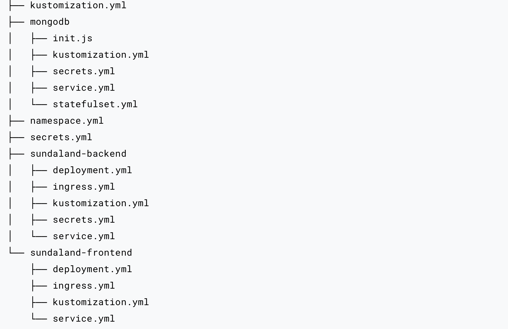

# kubernetes project

📂 Root Directory
├── 📄 kustomization.yml         # Root-level Kustomize configuration to aggregate all modules
├── 📂 mongodb                  # MongoDB Deployment Module
│   ├── 📄 init.js               # MongoDB initialization script
│   ├── 📄 kustomization.yml     # Kustomize config for MongoDB
│   ├── 📄 secrets.yml           # Sensitive data (e.g., MongoDB passwords)
│   ├── 📄 service.yml           # Exposes MongoDB as a service
│   └── 📄 statefulset.yml       # MongoDB StatefulSet for maintaining state
├── 📄 namespace.yml            # Namespace definition for isolation
├── 📄 secrets.yml              # Global secrets configuration
├── 📂 sundaland-backend        # Backend Service Module
│   ├── 📄 deployment.yml        # Deployment resource for the backend app
│   ├── 📄 ingress.yml           # Ingress configuration for external access
│   ├── 📄 kustomization.yml     # Kustomize config for backend
│   ├── 📄 secrets.yml           # Backend-specific sensitive data
│   └── 📄 service.yml           # Backend service definition
├── 📂 sundaland-frontend       # Frontend Service Module
│   ├── 📄 deployment.yml        # Deployment resource for the frontend app
│   ├── 📄 ingress.yml           # Ingress configuration for external access
│   ├── 📄 kustomization.yml     # Kustomize config for frontend
│   └── 📄 service.yml           # Frontend service definition
